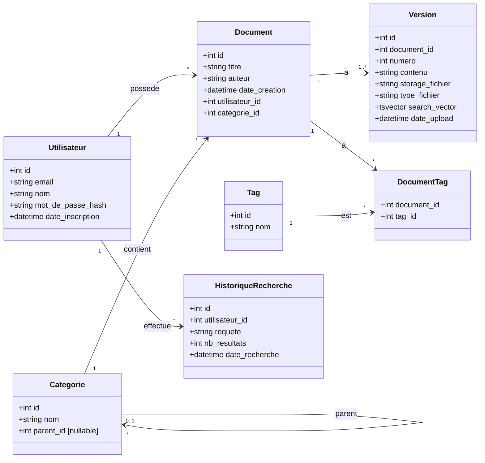
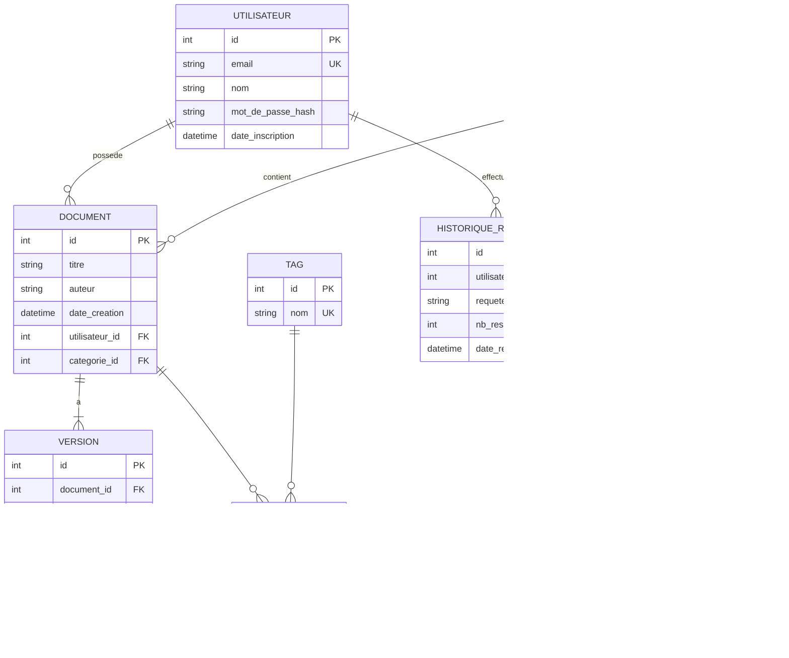

# Diagramme UML — DocManager

## Diagramme de classes

```mermaid
classDiagram
    direction LR

    class Utilisateur {
        +int id
        +string email
        +string nom
        +string mot_de_passe_hash
        +datetime date_inscription
    }

    class Categorie {
        +int id
        +string nom
        +int parent_id [nullable]
    }

    class Document {
        +int id
        +string titre
        +string auteur
        +datetime date_creation
        +int utilisateur_id
        +int categorie_id
    }

    class Version {
        +int id
        +int document_id
        +int numero
        +string contenu
        +string storage_fichier
        +string type_fichier
        +tsvector search_vector
        +datetime date_upload
    }

    class Tag {
        +int id
        +string nom
    }

    class DocumentTag {
        +int document_id
        +int tag_id
    }

    class HistoriqueRecherche {
        +int id
        +int utilisateur_id
        +string requete
        +int nb_resultats
        +datetime date_recherche
    }

    Utilisateur "1" --> "*" Document : possede
    Utilisateur "1" --> "*" HistoriqueRecherche : effectue
    Categorie "1" --> "*" Document : contient
    Categorie "0..1" --> "*" Categorie : parent
    Document "1" --> "1..*" Version : a
    Document "1" --> "*" DocumentTag : a
    Tag "1" --> "*" DocumentTag : est
```

## Diagramme entite-relation (MCD)

```mermaid
erDiagram
    UTILISATEUR {
        int id PK
        string email UK
        string nom
        string mot_de_passe_hash
        datetime date_inscription
    }

    CATEGORIE {
        int id PK
        string nom
        int parent_id FK "nullable, self-ref"
    }

    DOCUMENT {
        int id PK
        string titre
        string auteur
        datetime date_creation
        int utilisateur_id FK
        int categorie_id FK
    }

    VERSION {
        int id PK
        int document_id FK
        int numero
        string contenu
        string storage_fichier UK
        string type_fichier
        tsvector search_vector
        datetime date_upload
    }

    TAG {
        int id PK
        string nom UK
    }

    DOCUMENT_TAG {
        int document_id FK
        int tag_id FK
    }

    HISTORIQUE_RECHERCHE {
        int id PK
        int utilisateur_id FK
        string requete
        int nb_resultats
        datetime date_recherche
    }

    UTILISATEUR ||--o{ DOCUMENT : "possede"
    UTILISATEUR ||--o{ HISTORIQUE_RECHERCHE : "effectue"
    CATEGORIE ||--o{ DOCUMENT : "contient"
    CATEGORIE |o--o{ CATEGORIE : "sous-categorie de"
    DOCUMENT ||--|{ VERSION : "a"
    DOCUMENT ||--o{ DOCUMENT_TAG : ""
    TAG ||--o{ DOCUMENT_TAG : ""
```
